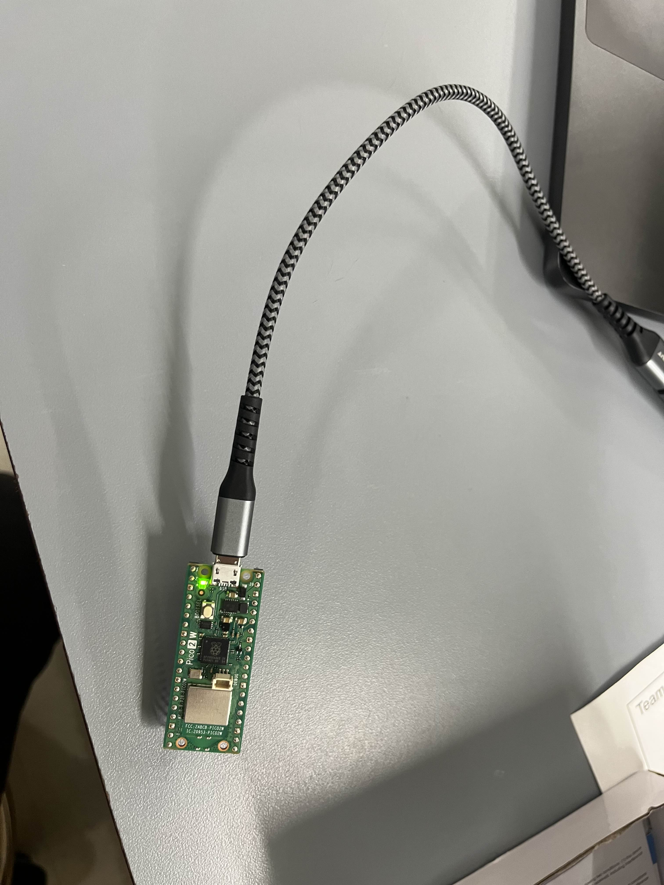
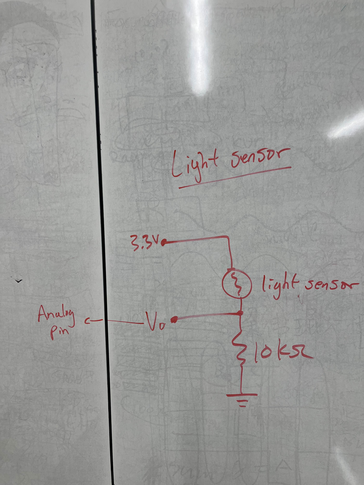
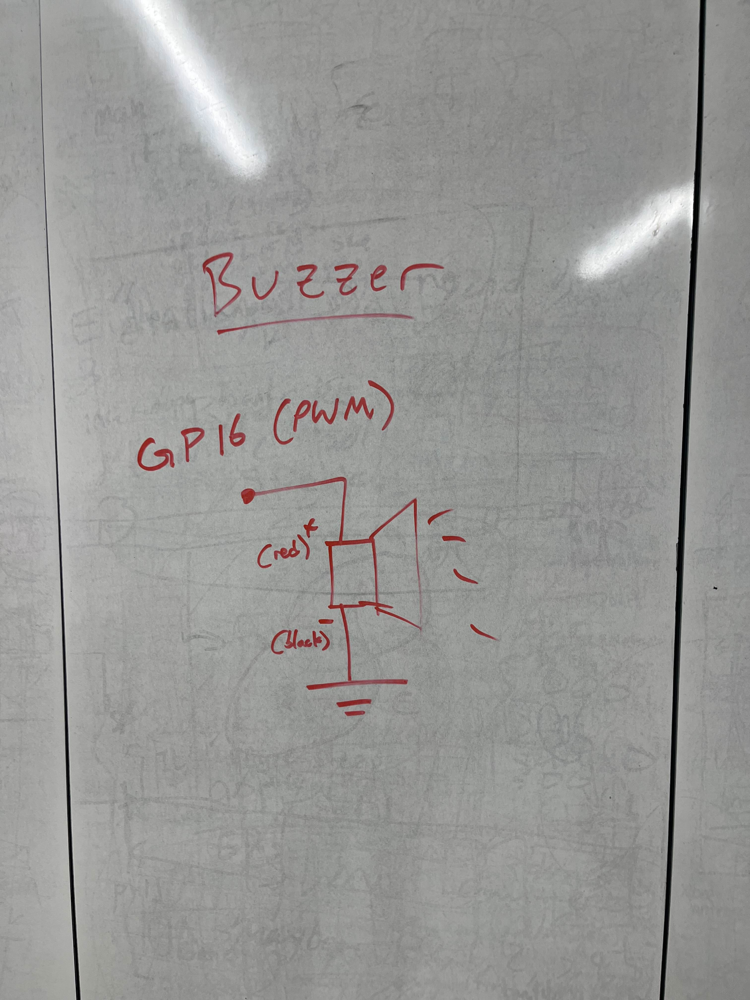
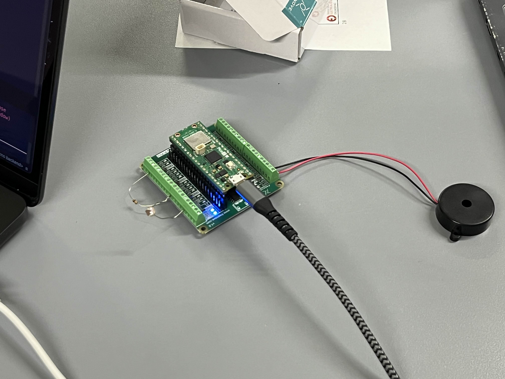
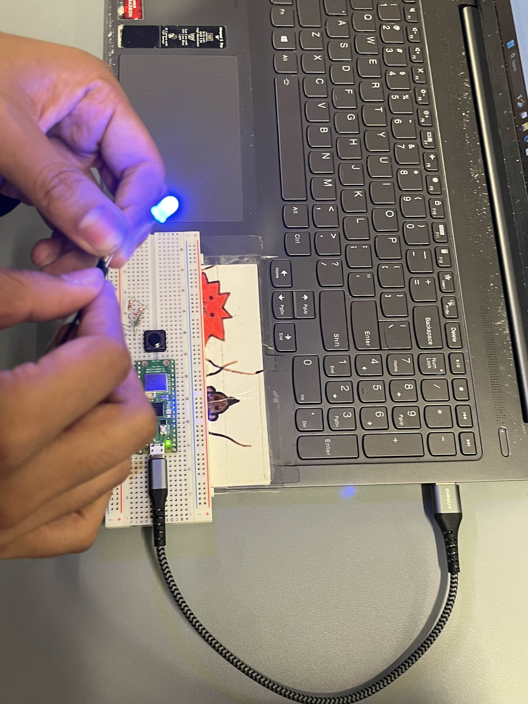
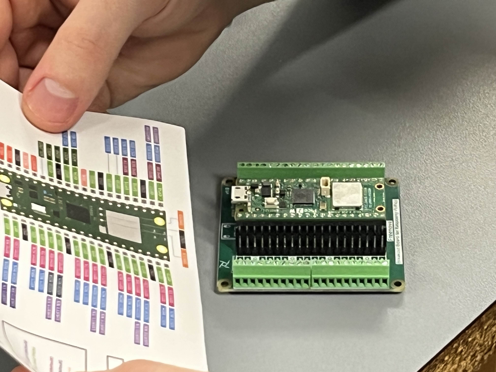
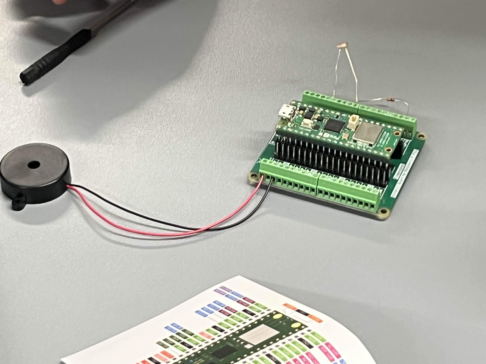

# 2025 Fall ECE Senior Design Miniproject

[Project definition](./Project.md)

This project uses the Raspberry Pi Pico 2WH SC1634 (wireless, with header pins).

Each team must provide a micro-USB cable that connects to their laptop to plug into the Pi Pico.
The cord must have the data pins connected.
Splitter cords with multiple types of connectors fanning out may not have data pins connected.
Such micro-USB cords can be found locally at Microcenter, convenience stores, etc.
The student's laptop is used to program the Pi Pico.
The laptop software to program and debug the Pi Pico works on macOS, Windows, and Linux.

This miniproject focuses on using
[MicroPython](./doc/micropython.md)
using
[Thonny IDE](./doc/thonny.md).
Other IDEs can be used, including Visual Studio Code or
[rshell](./doc/rshell.md).

## Hardware

* Raspberry Pi Pico WH [SC1634](https://pip.raspberrypi.com/categories/1088-raspberry-pi-pico-2-w) (WiFi, Bluetooth, with header pins)
* Freenove Pico breakout board [FNK0081](https://store.freenove.com/products/fnk0081)
* Piezo Buzzer SameSky CPT-3095C-300
* 10k ohm resistor
* 2 [tactile switches](hhttps://www.mouser.com/ProductDetail/E-Switch/TL59NF160Q?qs=QtyuwXswaQgJqDRR55vEFA%3D%3D)

### Photoresistor details

The photoresistor uses the 10k ohm resistor as a voltage divider
[circuit](./doc/photoresistor.md).
The 10k ohm resistor connects to "3V3" and to ADC2.
The photoresistor connects to the ADC2 and to AGND.
Polarity is not important for this resistor and photoresistor.

The MicroPython
[machine.ADC](https://docs.micropython.org/en/latest/library/machine.ADC.html)
class is used to read the analog voltage from the photoresistor.
The `machine.ADC(id)` value corresponds to the "GP" pin number.
On the Pico W, GP28 is ADC2, accessed with `machine.ADC(28)`.

### Piezo buzzer details

PWM (Pulse Width Modulation) can be used to generate analog signals from digital outputs.
The Raspberry Pi Pico has eight PWM groups, each with two PWM channels.
The [Pico WH pinout diagram](https://datasheets.raspberrypi.com/picow/PicoW-A4-Pinout.pdf)
shows that almost all Pico pins can be used for multiple distinct tasks as configured by MicroPython code or other software.
In this exercise, we will generate a PWM signal to drive a speaker.

GP16 is one of the pins that can be used to generate PWM signals.
Connect the speaker with the black wire (negative) to GND and the red wire (positive) to GP16.

In a more complete project, we would use additional resistors and capacitors with an amplifier to boost the sound output to a louder level with a bigger speaker.
The sound output is quiet but usable for this exercise.

Musical notes correspond to particular base frequencies and typically have rich harmonics in typical musical instruments.
An example soundboard showing note frequencies is [clickable](https://muted.io/note-frequencies/).
Over human history, the correspondence of notes to frequencies has changed over time and location, and musical cultures.
For the question below, feel free to use the musical scale of your choice!

[Music Examples](https://github.com/twisst/Music-for-Raspberry-Pi-Pico/blob/main/play.py)

## Notes

Pico MicroPython time.sleep() doesn't error for negative values even though such are obviously incorrect--it is undefined for a system to sleep for negative time.
Duty cycle greater than 1 is undefined, so we clip the duty cycle to the range [0, 1].

# Documentation, Design Process

Initially, we had one main goal: to create a minimum viable product (MVP) that performed the core functions of our Light Orchestra system. To accelerate progress, we divided tasks early and worked in parallel. 

As a group, we first experimented with using VS Code for MicroPython development, but encountered driver and REPL connection issues. Following the instructor’s recommendation, we switched to **Thonny IDE**, which gave us a reliable workflow for flashing code and interacting with the board. Below is an image of the Raspberry Pi Pico blinking through our setup. 

Following this, we briefly discussed the components we had as a group before splitting up tasks accordingly. First, we discussed the attributes of the light sensor and where it would fall into our overarching design. A diagram of our light sensor analysis is provided below. 

We then discussed the Buzzer we had and potential uses for it within our light orchestra machine. Specifically, we thought that it would be a good idea if the light sensor communciated with the buzzer in order to produce sounds based on the lumination readings it processed. A diagram of our buzzer analysis is provided below as well. 

We then split up the work so that we could efficiently work in parallel during this sprint. A thorough breakdown of each team member's work is provided below. Our thinking was to create many smaller proof of concepts (POC) in isolation with individual parts before putting them altogether to form our final light orchestra product. 

### Initial Design Idea

Our initial concept for the Light Orchestra was to make a small, interactive system that would be fun and engaging for kids. The idea was simple: use the Raspberry Pi Pico W to flash an RGB LED in different colors while also creating sounds through a buzzer. The light sensor would let the environment control the sound, so kids could cover or shine light on the sensor to change the pitch of the buzzer like a playful instrument. 

We wanted the design to feel more like a toy or learning tool than a strict engineering demo. That is why we aimed to combine both lights and sounds in a way that children could immediately understand and enjoy. Looking ahead, we also brainstormed the integration of more complex melodies and syncing them with changing LED colors, so that the project could grow from a simple blinking-and-beeping prototype into a miniature “orchestra” experience.

### Member Work Breakdown

Sitong focused on the **buzzer and light** sensor, recalling how PWM signals control pitch and duration. She started with a POC where the buzzer just played a constant sound. This soon expanded to a more robust approach where the light sensor would integrate and cause the pitch of the sound being played from the buzzer to change accordingly. She also encountered a problem: when covering the light source or exposing the sensor fully to light, the pitch change was not obvious, so she designed the code to detect real-time light intensity every second and print it, then reset the thresholds to distinguish between bright and dark light to solve this issue. Sitong also started exploring the integration of more complex melodies. A picture of the POC she tested on can be seen below. 

Xiang explored the **LED**, verifying the capabilities and use-cases of the provided RGB LED. The initial use of the LED proved harder than expected since it did not work first try. A deeper dive into exploring whether the LED was a Common Cathode or Common Anode was necessary. Through the use of a few separate electrical components and a breadboard, Xiang made a robust setup to test the light and eventually create a more complex piece of code that would trigger the light to flash in a unique manner, fitting for our final product. A picture of the POC he set up can be seen below.

Nathan concentrated on **wiring and hardware**. He was responsible for setting up the breadboard and ensuring each component had a stable connection to the Raspberry Pi Pico. After choosing an ideal pin layout, he connected the photoresistor and buzzer to their assigned pins, checking each connection carefully to avoid shorts. Once everything was wired, he worked with other group members to help them run their test code they were working on in isolation, which allowed the rest of the team to focus on writing code without worrying about hardware issues. A picture of Nathan’s early assembly process and final build can be seen below.

Rayan took ownership of **documentation and management**, writing the README and compiling the design notes so that the team’s progress was clearly recorded. He helped split tasks so that each member had a clear, parallel workstream during Sprint 1. In addition, he assisted Xiang on the LED work, helping to test different wiring configurations and measure readings with a multimeter. He also worked with Sitong to refine the approach for more complex melodies. He helped integrate all the isolated components into a final singular product as well.

### Testing

Everyone tested their own components after completing them with unit testing and simple hardware testing. For initial wiring, the board was simply connected to a host laptop to ensure communication was established. For the LED, a breadboard was used to test the LED along with more complex LED flashing patterns in isolation. The code for this is provided in `testing/led_test.py`. For the buzzer, a simple code was executed to ensure the buzzer could make sounds at the pitches we desired. The code for this is provided in `testing/buzzer_test.py`. 

### Problems Encountered

Problems here. 

### Final Outcome

We successfully created an MVP for this project. The  final code being run on the Raspberry Pi Pico can be seen at `src/Three_States_Music.py`. All four of our group members put the pieces of the project that each of us have been working on together. We ended up with an electronic musical instrument that has three tones (based on lighting conditions), and an RGB LED light that switches between red, green, and blue based on what tone the instrument is playing. The light changing based on lighting conditions can be seen in the 3 images below. The sound being played in each image is also different. We believe this product is perfect for entertaining our key users, children.

### GPT Conversations
* [Conversation on setting up MicroPico, buzzer, LED, and integration](https://chatgpt.com/share/68c63341-16cc-8011-a83d-0ff89710128b)

## Reference

* [Pico 2WH pinout diagram](https://datasheets.raspberrypi.com/picow/pico-2-w-pinout.pdf) shows the connections to analog and digital IO.
* Getting Started with Pi Pico [book](https://datasheets.raspberrypi.com/pico/getting-started-with-pico.pdf)
